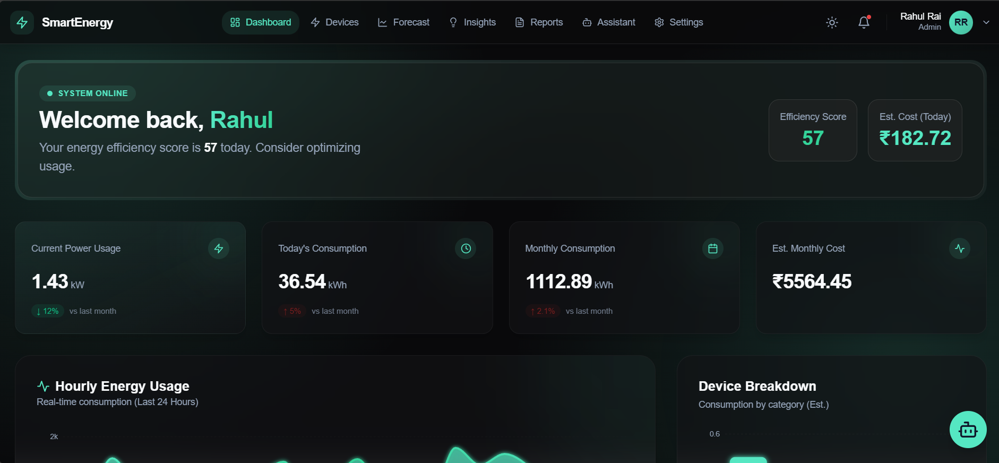
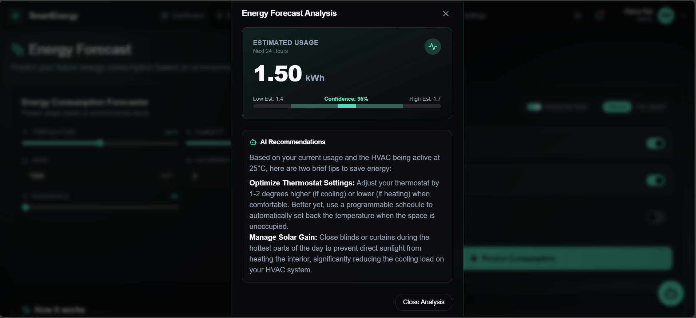
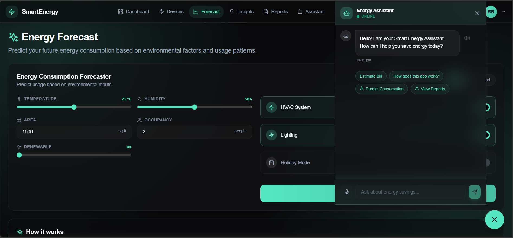
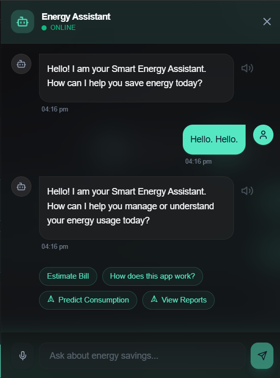
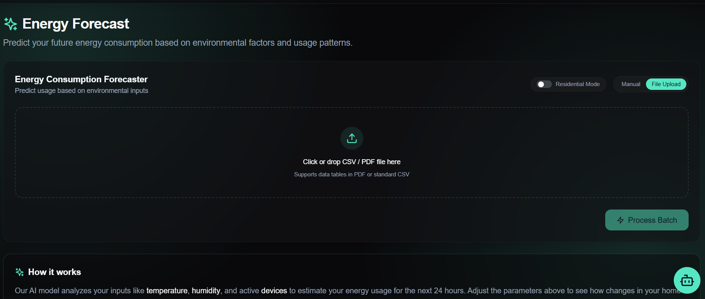
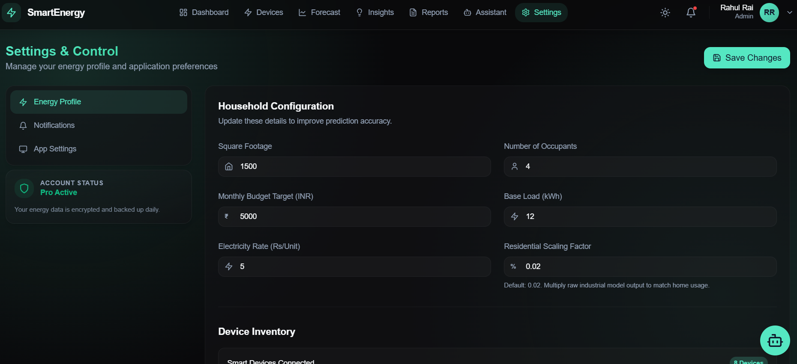

# Smart Energy Consumption Analysis and Prediction


A comprehensive full-stack application for monitoring, analyzing, and predicting energy consumption using machine learning and Generative AI. This system provides a modern dashboard for real-time visualization, an AI-powered assistant with voice capabilities, and batch processing for bulk energy data analysis.

**[View on GitHub](https://github.com/springboardmentor2001-sudo/Smart-Energy-Consumption-Analysis-and-Prediction/tree/Rahul-Rai)**

---

## 📸 Screenshots

| Dashboard Overview | Energy Analysis |
|:---:|:---:|
|  |  |
| *Real-time Energy Monitoring* | *Detailed Consumption Analysis* |

| AI Assistant | Voice Interaction |
|:---:|:---:|
|  |  |
| *Smart Assistant with Gemini* | *Voice Command & TTS* |

| Batch Prediction | Settings & Config |
|:---:|:---:|
|  |  |
| *Bulk CSV/PDF Processing* | *User Preferences* |

---

## 📂 Project Structure

```bash
Smart-Energy-Consumption/
├── Backend/                 # Flask API, Auth & ML Models
│   ├── Dataset/            # Training data (Energy_consumption.csv)
│   ├── app.py              # Main application entry point
│   ├── lgb_model_clean.pkl # Pre-trained LightGBM model
│   └── requirements.txt    # Python dependencies
├── UI/                     # React Frontend
│   ├── src/
│   │   ├── components/     # Reusable UI components
│   │   ├── pages/          # Application routes (Dashboard, Assistant, etc)
│   │   └── services/       # API integration
│   └── tailwind.config.js  # Styling configuration
└── Medias/                 # Project screenshots
```

---

## ✨ Key Features

### 📊 Interactive Dashboard
- **Real-time Visualization**: Dynamic charts showing energy usage trends over time.
- **Device Breakdown**: Categorized usage stats (HVAC, Lighting, etc.) with efficiency scores.
- **Cost Estimation**: Live calculation of daily and monthly projected costs.

### 🤖 AI-Powered Assistant
- **Gemini Integration**: Context-aware chat for energy queries and savings tips.
- **Voice-Enabled**:
    - **Speech-to-Text (STT)**: Ask questions using your microphone.
    - **Text-to-Speech (TTS)**: Listen to the assistant's responses.
- **Smart Prediction**: Ask natural language questions like *"Predict energy for 25C temp and 2 people"* to trigger ML models.

### 📝 Batch Data Processing
- **Bulk Analysis**: Upload CSV or PDF files containing historical data.
- **Automated forecasting**: Get energy predictions for thousands of records instantly.
- **PDF Extraction**: Intelligent parsing of energy data tables from PDF reports using Gemini.

### ⚙️ Smart Settings
- **Customizable Profile**: Set your budget, energy rates, and household parameters.
- **Theme Support**: Toggle between Light and Dark modes.

---

## 🛠️ Technology Stack

### Frontend
- **React**: Component-based UI architecture.
- **Vite**: Next-generation frontend tooling.
- **Tailwind CSS**: Utility-first styling for modern, responsive designs.
- **Lucide React**: Beautiful & consistent iconography.
- **Recharts**: Composable charting library.

### Backend
- **Flask**: Lightweight Python web server.
- **Google Generative AI (Gemini)**: For natural language processing and data extraction.
- **Pandas & NumPy**: Data manipulation and analysis.
- **Machine Learning**: LightGBM/XGBoost models for accurate energy forecasting.
- **MongoDB**: Database for user authentication and feedback storage.

---

## 🚀 Installation & Setup

### Prerequisites
- Node.js (v18+)
- Python (v3.9+)
- MongoDB (Local or Atlas)
- Google Gemini API Key

### 1. Backend Setup

Navigate to the backend directory and install dependencies:
```bash
cd Backend
pip install -r requirements.txt
```

**Configuration**:
Create a `.env` file in the `Backend` folder with the following variables:

```env
# Required for AI Features
GEMINI_API_KEY=your_gemini_api_key

# Required for Authentication & Database
MONGO_URI=mongodb://localhost:27017/smart_energy_db
JWT_SECRET_KEY=your_super_secret_key

# Optional: Model URL for remote loading (if needed)
# MODEL_URL=https://example.com/model.pkl
```

Run the server:
```bash
python app.py
```

### 2. Frontend Setup

Navigate to the UI directory and install dependencies:
```bash
cd UI
npm install
```

Run the development server:
```bash
npm run dev
```

### 3. Usage
- Open your browser at `http://localhost:5173`.
- **Login/Signup**: Create an account to access personalized features.
- Navigate to **"Assistant"** to try the Voice Chat.
- Go to **"Batch Prediction"** to upload a CSV/PDF for analysis.

---

## 📄 License
This project is licensed under the MIT License.
